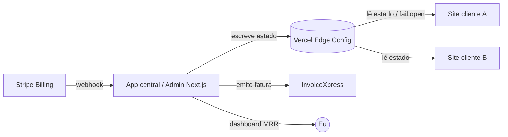
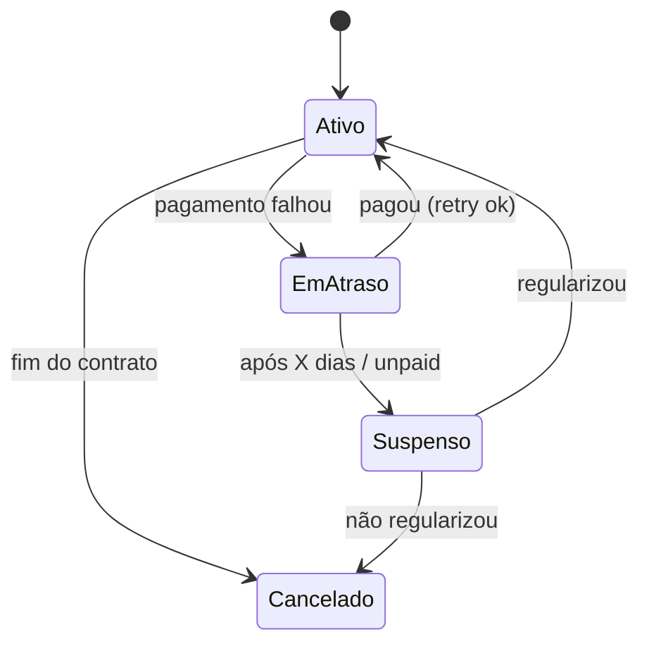

# Sistema de gestão de clientes (billing + kill-switch)

> [!info] O que é
> O "sistema operativo" da agência: um painel que sabe **quem são os clientes**, **que plano têm**, **se pagaram**, e que **corta o serviço** automaticamente a quem não paga. Transforma "vários clientes" de caos em gestão.

> 🔗 Liga a: [[Modelo de negócio e planos (avença)]] · [[Custos e margem (EBeauty)]] · [[Ponto de situação]]

> [!warning] Quando construir
> Com **1 cliente (EBeauty) é overkill** — vês se pagou e pronto. Paga-se a partir de **~3 clientes** (como o VPS). Não construir antes de fazer falta.

---

## 🧱 Princípio nº1 — não construir o motor de pagamentos

A parte de *"recebeu? falhou? reenviar? cancelar? impostos?"* é um inferno de *edge cases* e **já existe pronta**. Delegar a **Stripe Billing** (ou Paddle / Lemon Squeezy). Eu só **consumo os webhooks** e construo o que é meu: o **painel** + a **lógica de cortar**.

---

## 🪜 As duas camadas

### 1. Estado (billing) — delegado
- **Stripe Billing:** 1 produto por plano (Mensal / Anual / Performance), preço recorrente.
- **Webhook** → atualiza o estado de cada cliente:
  - `invoice.paid` → **ativo**
  - `invoice.payment_failed` → **em atraso**
  - subscrição `canceled` / `unpaid` → **suspenso / cancelado**

### 2. Aplicação ("cortar o serviço") — o meu código
Padrão **kill-switch por licença** (nunca apagar nada):
- Serviço central guarda, por cliente: estado + plano + features (IA on/off, quotas).
- Cada site lê o **seu** estado e, se `suspenso`, mostra página **"serviço suspenso / contacte-nos"** em vez do conteúdo.
- Marco como suspenso → o site **vira na leitura seguinte**, sem deploy.

---

## 🏗️ Arquitetura recomendada (no meu stack)



| Peça | Escolha | Porquê |
|---|---|---|
| Pagamentos (verdade) | **Stripe Billing** | retries, dunning, cancelamento já feitos |
| App central / registo | **Next.js + DB (Neon/Upstash)** ou **o próprio Sanity** | Sanity = já sei usar + UI de edição grátis |
| Distribuição de estado | **Vercel Edge Config** | leitura instantânea, quase grátis, feito p/ flags |
| Faturação legal PT | **InvoiceXpress** (API) | Stripe **não** emite fatura-recibo legal PT |
| Painel | lista clientes, estado, próxima cobrança, **MRR** | é o "facilita a gestão" |

---

## 🔄 Estados do cliente



| Estado | Site do cliente | Ação minha |
|---|---|---|
| **Ativo** | normal | — |
| **Em atraso** | normal + (opcional) banner/email | tolerância: Stripe faz retries |
| **Suspenso** | página "serviço suspenso" + **IA desligada** | regularizar para reativar |
| **Cancelado** | fora do ar / handover | entrega de acessos conforme propriedade |

---

## ⚠️ Cuidados (separam isto de um tiro no pé)

- **Período de tolerância (dunning).** Nunca cortar no segundo em que falha — cartões falham por motivos benignos. Falha → **em atraso** (retries + emails) → após X dias → **suspende**.
- **Suspensão gradual (soft → hard):** aviso/email → degradar (**desligar a IA** corta logo o meu custo) → só depois a página de suspensão.
- **⭐ Fail open.** Se o **meu** serviço central cair, os sites dos clientes **não podem cair com ele** — na dúvida, assumem `ativo`. O billing nunca pode ser ponto único de falha deles.
- **Base contratual.** O direito a suspender por não-pagamento tem de estar **no contrato** ([[Modelo de negócio e planos (avença)]]). Sem base = disputa.
- **Não tomar dados como reféns.** Suspender o front-end é legítimo; apagar o conteúdo (Sanity) não — depende do modelo de propriedade.

---

## 🗂️ Modelo de dados (registo de clientes)

```
cliente {
  id
  nome
  dominios[]
  plano            // mensal | anual | performance
  stripe_customer_id
  stripe_subscription_id
  estado           // ativo | em_atraso | suspenso | cancelado
  features {
    ia: bool
    ia_quota_mes
    edicoes_quota_mes
  }
  proxima_cobranca
  valor_mensal
  notas
}
```

> Em Edge Config publico só o essencial e rápido de ler: `{ dominio → { estado, ia, quotas } }`.

---

## 🪜 Faseamento (não construir tudo de uma vez)

1. **Fase 1 — manual:** painel + lista de clientes + **toggle manual** de estado + o *license-check* nos sites. Marco "pago" à mão. **Enorme valor com pouco código** (já tenho o kill-switch central).
2. **Fase 2 — automático:** Stripe webhooks → estado automático + suspensão com tolerância.
3. **Fase 3 — completo:** faturação automática (InvoiceXpress), emails de dunning, analytics de **MRR / churn**.

---

## ♻️ Sinergias

- O **kill-switch por cliente** é o **mesmo mecanismo** do teto de custo da IA (ver [[Custos e margem (EBeauty)]]) → construo uma vez, serve para os dois.
- As **features por cliente** (IA on/off, quotas) mapeiam diretamente os **planos** ([[Modelo de negócio e planos (avença)]]).
- O **license-check** é o mesmo padrão se um dia migrar do Vercel para **VPS + Coolify** (a 5+ clientes).

---

## 💶 Custo do próprio sistema

- Stripe: sem mensalidade, **% por transação** (~1,4% + €0,25 cartão UE) — custo sobre o que recebo.
- Edge Config / app central: praticamente grátis à escala de poucos clientes.
- InvoiceXpress: ~€9–25/mês (só quando justificar).
- ⚠️ É **infra interna minha** — não a repasso ao cliente; entra nos meus custos de operação.

---

## ❓ Decisões em aberto

- [ ] Gateway: **Stripe** vs gateway local PT (IfthenPay/Easypay/Eupago) — MB Way pesa na escolha.
- [ ] Registo de clientes em **Sanity** (familiar) vs **Postgres** (transacional).
- [ ] Dias de tolerância antes de suspender (ex.: 7–14).
- [ ] Suspensão = página dedicada vs redirect vs site em read-only.
- [ ] Integrar **InvoiceXpress** desde a Fase 1 ou só na Fase 3.
- [ ] Cláusula de suspensão por não-pagamento escrita no contrato.
